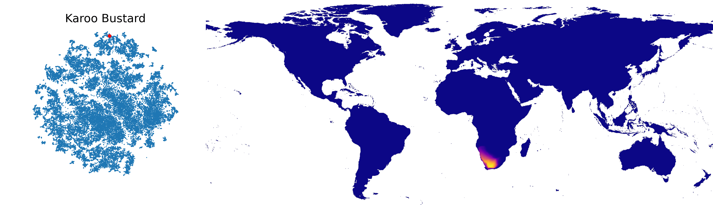

# Spatial Implicit Neural Representations for Global-Scale Species Mapping - ICML 2023

Code for training and evaluating global-scale species range estimation models. This code enables the recreation of the results from our ICML 2023 paper [Spatial Implicit Neural Representations for Global-Scale Species Mapping](https://arxiv.org/abs/2306.02564). 

## 🌍 Overview 
Estimating the geographical range of a species from sparse observations is a challenging and important geospatial prediction problem. Given a set of locations where a species has been observed, the goal is to build a model to predict whether the species is present or absent at any location. In this work, we use Spatial Implicit Neural Representations (SINRs) to jointly estimate the geographical range of thousands of species simultaneously. SINRs scale gracefully, making better predictions as we increase the number of training species and the amount of training data per species. We introduce four new range estimation and spatial representation learning benchmarks, and we use them to demonstrate that noisy and biased crowdsourced data can be combined with implicit neural representations to approximate expert-developed range maps for many species.


<sup>Above we visualize predictions from one of our SINR models trained on data from [iNaturalist](inaturalist.org). On the left we show the learned species embedding space, where each point represents a different species. On the right we see the predicted range of the species corresponding to the red dot on the left.<sup>

## 🔍 Set up instructions 

#### Installing Required Packages

1. We recommend using an isolated Python environment to avoid dependency issues. Install the Anaconda Python 3.9 distribution for your operating system from [here](https://www.anaconda.com/download). 

2. Create a new environment and activate it:
```bash
 conda create -y --name sinr_icml python==3.9
 conda activate sinr_icml
```

3. After activating the environment, install the required packages:
```bash
 pip3 install -r requirements.txt
```

Continue to Data Download and Preparation

#### Instructions for downloading and setting up Training & Evaluation Data

1. Navigate to the repository root directory:
```bash
cd /path/to/sinr/
```

2. Download the data file:
```bash
curl -L https://data.caltech.edu/records/b0wyb-tat89/files/data.zip --output data.zip
```

3. Extract the data and clean up:
```bash
unzip -q data.zip
```

4. Clean up:
```bash
rm data.zip
```

#### Instructions for downloading and setting up Environmental Features

1. Navigate to the directory for the environmental features:
```
cd /path/to/sinr/data/env
```

2. Download the data:
```bash
curl -L https://geodata.ucdavis.edu/climate/worldclim/2_1/base/wc2.1_5m_bio.zip --output wc2.1_5m_bio.zip
curl -L https://geodata.ucdavis.edu/climate/worldclim/2_1/base/wc2.1_5m_elev.zip --output wc2.1_5m_elev.zip
```

3. Extract the data:
```bash
unzip -q wc2.1_5m_bio.zip
unzip -q wc2.1_5m_elev.zip
```

4. Run the formatting script:
```bash
python format_env_feats.py
```

5. Clean up:
```bash
rm *.zip
rm *.tif
```

After following these instructions, the `data` directory should have the following structure:
```
data
├── README.md
├── env
│   ├── bioclim_elevation_scaled.npy
│   └── format_env_feats.py
├── eval
│   ├── geo_feature
│   │   ├── ABOVE_GROUND_CARBON.tif
│   │   ├── ELEVATION.tif
│   │   ├── LEAF_AREA_INDEX.tif
│   │   ├── NON_TREE_VEGITATED.tif
│   │   ├── NOT_VEGITATED.tif
│   │   ├── POPULATION_DENSITY.tif
│   │   ├── SNOW_COVER.tif
│   │   ├── SOIL_MOISTURE.tif
│   │   └── TREE_COVER.tif
│   ├── geo_prior
│   │   ├── geo_prior_model_meta.csv
│   │   └── geo_prior_model_preds.npz
│   │   └── taxa_subsets.json
│   ├── iucn
│   │   └── iucn_res_5.json
│   └── snt
│       └── snt_res_5.npy
├── masks
│   ├── LAND_MASK.tif
    ├── ocean_mask.npy
    ├── ocean_mask_hr.npy
│   └── USA_MASK.tif
└── train
    ├── geo_prior_train.csv
    └── geo_prior_train_meta.json
```

Now you should be all done! Continue to learn about how to use the geomodel to make predictions and do experiments.

## Using the model and training
There are a variety of ways to use the models and make predictions, this section will walk you through on how to use this codebase effectively.

### 🗺️ Generating Predictions
To generate predictions for a model in the form of an image, run the following command: 
```bash
 python viz_map.py --taxa_id 130714
```
Here, `--taxa_id` is the id number for a species of interest from [iNaturalist](https://www.inaturalist.org/taxa/130714). If you want to generate predictions for a random species, add the `--rand_taxa` instead. 

Note, before you run this command you need to first download the data as described in `Set up instructions`. In addition, if you want to evaluate some of the pretrained models from the paper, you need to download those first and place them at `sinr/pretrained_models`. See `Web App for Visualizing Model Predictions` below for more details.

### 🚅 Training and Evaluating Models

To train and evaluate a model, run the following command, requires GPU:
```bash
 python train_and_evaluate_models.py
```

#### Hyperparameters
Common parameters of interest can be set within `train_and_evaluate_models.py`. All other parameters are exposed in `setup.py`. 

#### Outputs
By default, trained models and evaluation results will be saved to a folder in the `experiments` directory. Evaluation results will also be printed to the command line. 

### 🌐 Web App for Visualizing Model Predictions

Gradio app for exploring different model predictions.

####  Downloading the pretrained models
To use the web app, you must first download the pretrained models from [here](https://data.caltech.edu/records/dk5g7-rhq64/files/pretrained_models.zip?download=1) and place them at `sinr/pretrained_models`. See `app.py` for the expected paths. 

####  Starting the app
Activate the SINR environment:
```bash
 conda activate sinr_icml
```
Navigate to the web_app directory:
```bash
 cd /path/to/sinr/web_app
```
Launch the app:
```bash
 python app.py
```
Click on or copy the local address output in the command line and open this in your web browser in order to view the web app. This will look something like:
```bash
 Running on local URL:  http://127.0.0.1:7860
```
#### Controlling the app
* From here use your mouse and the dropdown menus to choose which model and species you wish to visualize.
* Taxon IDs are aligned with those from [iNaturalist](iNaturalist.org), so if you wish to find a specific taxon you can search within the iNaturalist site and then copy the taxon ID into the web app. Note that not all taxa from iNaturalist are present in all models. 
    * For example, to view the predicted species range for the Northern Cardinal, navigate to the iNaturalist page for this taxon (https://www.inaturalist.org/taxa/9083-Cardinalis-cardinalis) and set the taxon ID in the app to `9083` and click "Run Model".
* To generate a thresholded predicted range select the "threshold" button and use the slider to choose the threshold value.

##  🙏 Acknowledgements
This project was enabled by data from the Cornell Lab of Ornithology, The International Union for the Conservation of Nature, iNaturalist, NASA, USGS, JAXA, CIESIN, and UC Merced. We are especially indebted to the [iNaturalist](inaturalist.org) and [eBird](https://ebird.org) communities for their data collection efforts. We also thank Matt Stimas-Mackey and Sam Heinrich for their help with data curation. This project was funded by the [Climate Change AI Innovation Grants](https://www.climatechange.ai/blog/2022-04-13-innovation-grants) program, hosted by Climate Change AI with the support of the Quadrature Climate Foundation, Schmidt Futures, and the Canada Hub of Future Earth. This work was also supported by the Caltech Resnick Sustainability Institute and an NSF Graduate Research Fellowship (grant number DGE1745301).  

If you find our work useful in your research please consider citing our paper.  
```
@inproceedings{SINR_icml23,
  title     = {{Spatial Implicit Neural Representations for Global-Scale Species Mapping}},
  author    = {Cole, Elijah and Van Horn, Grant and Lange, Christian and Shepard, Alexander and Leary, Patrick and Perona, Pietro and Loarie, Scott and Mac Aodha, Oisin},
  booktitle = {ICML},
  year = {2023}
}
```

## 📜 Disclaimer
Extreme care should be taken before making any decisions based on the outputs of models presented here. Our goal in this work is to demonstrate the promise of large-scale representation learning for species range estimation, not to provide definitive range maps. Our models are trained on biased data and have not been calibrated or validated beyond the experiments illustrated in the paper. 

